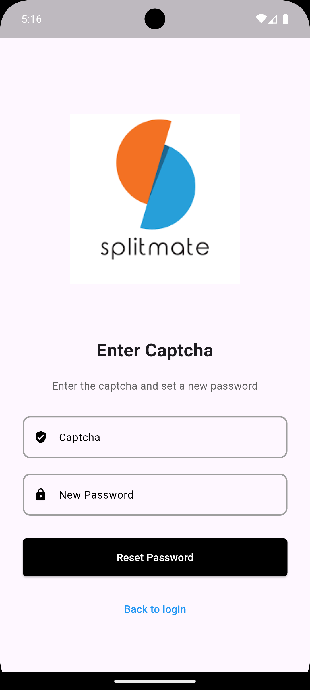

# splitmate_beta_flutter

Flutter APP for SplitMate-Beta

## Getting Started

This project is a starting point for a Flutter application.

A few resources to get you started if this is your first Flutter project:

- [Lab: Write your first Flutter app](https://docs.flutter.dev/get-started/codelab)
- [Cookbook: Useful Flutter samples](https://docs.flutter.dev/cookbook)

For help getting started with Flutter development, view the
[online documentation](https://docs.flutter.dev/), which offers tutorials,
samples, guidance on mobile development, and a full API reference.

## Weekly Progress

### Week 04
1. The overall development route is clarified, and the entire project uses the GetX library as a state management tool;
2. Rethink the project architecture(not determined, still need to talk with other group members in the weekly meeting);
3. Implement three pages: Login page, apply page and splash screen.

### Week 05
1. Two new pages have been developed, namely the send email page and the reset password page;
2. Agreed on the page style, which is specifically reflected in: ① Unified button colors; ② Abandoned the use of toast to display prompt information and agreed to use page pop-up boxes;
3. Now the login and new user application pages can interact with the server. Other pages do not have the function of sending network requests because the server has not yet developed the corresponding interface.

